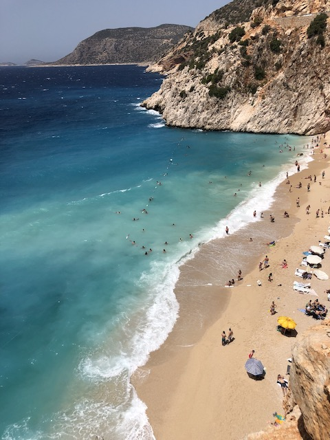
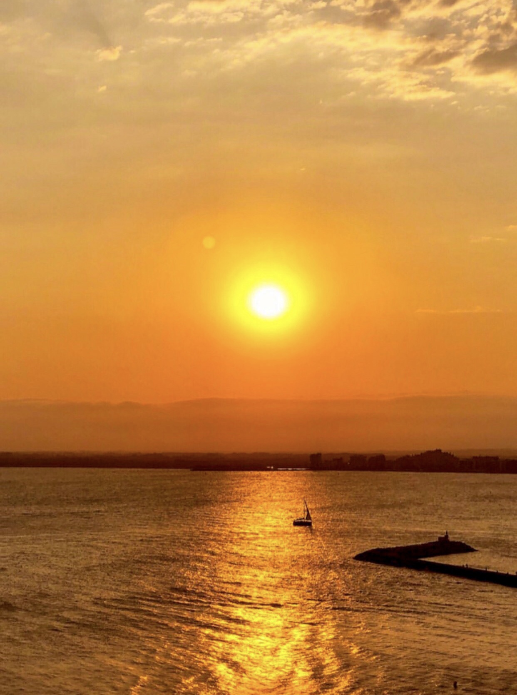
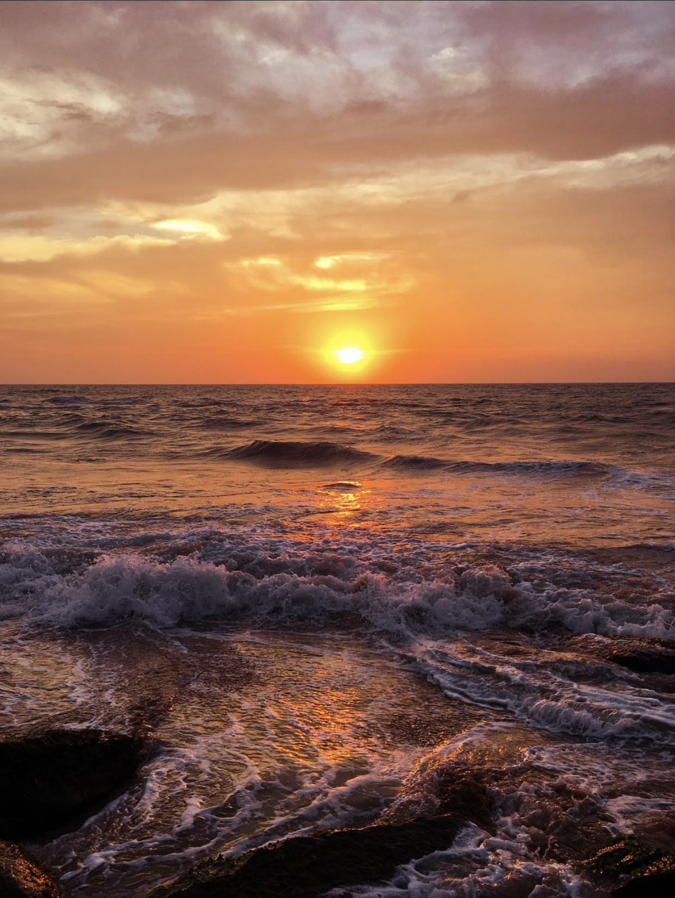

<!doctype html>
<html lang="tr">
     <head>
         <meta charset="utf-8">
         <meta name="description" content="Profesyonel Web Tasarımı">
         <meta name="author" content="Bluenavy Yazılım">
         <meta name="keywords" content="Html Css">
         <meta name="viewport" contetnt="width=device-width, initial-scale=1.0">

         <title>Mustafa Can Doğan - Home </title>

         <link rel="stylesheet" type="text/css" href="https://stackpath.bootstrapcdn.com/font-awesome/4.7.0/css/font-awesome.min.css">

        <link rel="stylesheet" type="text/css" href="./reset.css">
        <link rel="stylesheet" type="text/css" href="./site.css">
     </head>

     <body>
        <header>
            

                

                    
            

            

                <ul>
                    <li><a href="site.html">HOME</a></li>
                    <li><a href="gallery.html">GALLERY</a></li>
                    <li><a href="about.html">ABOUT</a></li>
                    <li><a href="contact.html">CONTACT</a></li>
                </ul>
            

        

    </header>

    <!-- MAIN SECTION -->

    <section id="mainSlider" class="slider">
        

            <h1>WELCOME TO MY EXCLUSİVE TRAVEL PAGE</h1>
            
On This Page You Embark On A Journey Full Of Art And Natural Beauty

        

    </section>

    <!-- FEATURE SECTION -->

    <section id="features" class="sectionArea">
         

             <h2 class="sectionHeader">Natural Beauties</h2>
             
The Right Time For The Best Photo

         

         

         

             

                 

                     

                        
                     

                     

                         <h3>Kaputas Beach</h3>
                         
It ıs located between Kas and Kalkan district of Antalya

                         <a href="#" class="btnDetails">More Details</a>
                

            

        

                

                    

                        

                            
                        

                        

                            <h3>Sarsala</h3>
                            
A bay about 15 kilometers from Muğla's Dalaman district

                            <a href="#" class="btnDetails">More Details</a>
                

            

        

                

                    

                        

                            
                

                

                                <h3>Düden Waterfall</h3>
                                
A natural beauty in Antalya's Muratpaşa district

                                <a href="#" class="btnDetails">More Details</a>
                            

                        

                    
            
                

            

    </section>

    <!-- PARALLAX SECTION -->

    <section id="parallax" class="sectionArea">
        

           <h2 class="sectionHeader">SUNSET</h2>
        

    </section>
    

    <!-- ENGINE SECTION -->

    <section id="engine" class="sectionArea">
        

            <h2 class="sectionHeader">SUNSET SHOTS</h2>
            
A Unique Bay in The Fethiye District of Muğla

        

            

            

            

            

            
            

            
Image Text

        

    

        

            

            
            

                 
Image Text

              

            

          

        

    

</section>

    <!-- FOOTER SECTION -->

     <footer class="sectionArea">
         

             

                 

                     <h3>WELCOME TO OUR SITE</h3>
                     
                     
Explore a World Where Nature And Art Meet

                 

              

     

         

            <h3>QUICK LINKS</h3>
                    <ul class="footerLinks">
                        <li><a href="site.html">HOME</a></li>
                        <li><a href="gallery.html">GALLERY</a></li>
                        <li><a href="about.html">ABOUT</a></li>
                        <li><a href="contact.html">CONTACT</a></li>
                 </ul>
               

             

    

        

            <h3>BE SOCIAL WITH US</h3>
                <ul class="socialLinks">
                        <li><a href="#"><i class="fa fa-twitter"></i></a></li>
                        <li><a href="#"><i class="fa fa-instagram"></i></a></li>
                        <li><a href="#"><i class="fa fa-linkedin"></i></a></li>
                 </ul>
               

             

           
    
     </footer>
    </body> 
</html>
